> 来源: [飞书知识库](https://larkcommunity.feishu.cn/wiki/JdscwcN7ji2kCHke3V5chJJWnbe)
> 节点: `JdscwcN7ji2kCHke3V5chJJWnbe` | 文档类型: `docx` | 最近编辑(unix): `1790059157`

*🌟 欢迎加入「抖音校园社群9月试营业」*

*9月，我们会陪你一起把本校社群从0跑到1：*

这份手册会告诉你：这个社群想做成什么、两个阶段需要完成哪些任务；

可以使用哪些运营工具，以及需要遵守哪些运营边界。

---

# 社群定位&长期建设目标

**WowLand，是陪大学生真实开始、持续生长的成长世界。**

WowLand面向大学生带来三个系列活动品牌，支持大学生在行动中成长，让想法落地、让创造被看见。

- **抖音AI创变者计划——让创意照进现实**为大学生打造的AI创新实践平台，支持技能提升、产品与作品创作，连接真实产业与职业机会。
- **WowLand｜成长现场——向世界生长，向自己扎根**属于大学生的行动与社交场域，通过真实经验、具体行动和社交连接，解决困惑、找到方向。
- **WowLand｜野生创作Camp——你看见了世界，世界就会看见你**属于大学生的内容创作舞台，从自己真实生活出发，也走进更广阔人生样本，创作真诚、好看、有价值的内容。

同时，依托抖音，WowLand将根据具体项目提供方法与导师指导、流量扶持和项目资源支持，以及相关工作机会。

**WowLand运营阵地将在抖音群聊，未来所有的活动会有两种群：**

<grid>
<column width-ratio="0.500000">
**WowLand 校园常设群**
成员进入WowLand的参与入口。**WowLand活动招募、报名安排、学习资源与社群专属权益，都将在群内发布。**大家可以在这里获取信息、报名参与，以及组织本校社群自己的线下活动。
</column>
<column width-ratio="0.500000">
**WowLand 活动群**
围绕具体项目建立的群。项目期间，成员在群内完成学习、组队和作品。项目结束后，成员和成果回到本校WowLand社群，继续参与新的项目。
</column>
</grid>

<callout emoji="🌐">
**校园常设群社群集合页： https://bytedance.feishuapp.cn/app/app_17e3sj1n00y**
</callout>

## **社群运营人需要做什么？**

**大家会作为校园常设群的群管理员。**

**你需要持续吸引社群成员加入，支持WowLand活动开展，打造一个WowLand专属阵地：**

| **职责** | 需要完成的动作 |
|-|-|
| **持续招新** | 结合官方招募和本校渠道，持续邀请真正感兴趣的同学加入，扩大本校社群的成员基础 |
| **维系社群成员和秩序** | 审核新成员，及时回应问题并维护群内秩序 |
| **组织社群参与活动** | WowLand会发布项目机会，向成员讲清参与方式和时间节点，定向邀请合适的人报名，并跟进参与 |
| **发起社群专属活动** | 根据本校成员的兴趣和需求，组织线下社交聚会、看片会、主题交流等活动（项目组会提供一套精心设计的有趣活动玩法，SOP、活动资源支持供后续大家取用） |
| **记录与复盘** | 记录增长、真实交流、整理出成员故事或社群内容，让优秀成果被更多人看见，逐步建立稳定的社群关系 |

*\*平台项目会由项目组提供统一的项目说明、招募物料、时间节点和群内发布内容。*

*社群运营人负责结合本群情况完成发布、解释、定向邀约、参与组织。*

## **社群运营人可以获得什么**

加入WowLand、负责社群运营后，你就正式成为一名 **Wow 发起人**。**你将：**

**获得正式的社群运营身份及相应管理权限**

- 获得社群管理权限、参加社群运营、活动组织及团队协作等专项培训
- 可根据实际活动申请经费、物料、嘉宾及传播支持

**做出结果，有运营激励**

- 完成基础运营职责并达到要求后，可获得按月发放的运营津贴（根据负责社群规模和质量确定）
- 运营能力和结果经过验证后，可以负责更多社群或更大项目，并获得相应资源和激励

**运营成果将作为后续成长、专项激励和重点机会推荐的重要依据**

- 运营成果突出的人，可以申请更多活动经费、嘉宾和传播资源
- 优先参与伙伴大会、AI实践营、职业辅导、品牌活动和重点项目共创
- 表现优秀者可以承担更大的跨校项目，并进入实习及工作机会的择优推荐范围

<callout emoji="💬">
**社群运营并不是一个普通群聊运营，是一段完整的运营经历**
你将招募本校成员、洞察真实需求、组织成员交流，并沉淀活动与内容，锻炼用户增长、用户运营、内容策划和项目运营能力。如果你希望在未来求职、升学或申请项目时，证明自己具备从0到1推进项目、理解用户、组织协作和解决实际问题的能力，这会成为一段能写进简历、也能有真实数据和成果证明的项目经历。
*WowLand社群运营｜2026.09至2026.XX*
*负责本校WowLand社群启动及日常运营，X周招募X名有效成员；根据成员需求策划X场线上讨论和线下活动，实际参与X人，其中X人再次参与；组织X人参与重点项目，完成X篇成员故事及社群内容。*
</callout>

## 社群运营人长期成长路径

从**Wow发起人**出发，在接下来的半年里，表现优秀的发起人有机会晋级为 **L4 Wow 领航者**，担任本校 WowLand 的总负责人，统筹 AI 相关活动、WowLand 原有活动以及社群运营。

所有加入群聊的人，就是社群的**Wow好奇星人（L1）**啦\~  大家都可以通过活跃社群、参与活动、创作内容等多种方式来解锁新身份，随着参与的深度和广度更大，解锁的身份与权益也会对应递进！

**Wow奇遇者（L2）**

- 参与各类社群活动、做出作品/成果，在社群中分享想法与经验，带动更多人交流和尝试。
- 优秀成果有机会获得活动激励、进入抖音生态并获得传播支持，部分项目提供官方实践证明。

**👉🏻（你现在在这里🙋🏻‍♀️） Wow发起人（L3）** 

- 策划并落地各类活动、或运营WowLand社群，持续招新、扩大规模、促进交流与项目参与。
- 可获得培训、资金及其他资源支持，表现优秀可获得实践证明、专项激励，并优先参与AI实践营、1V1职业辅导。

**Wow领航者（L4）**

- 在校园组建并带领团队，统筹本校WowLand活动与社群运营。
- 获得项目与团队运营的资源支持，参加抖音品牌活动及WowLand伙伴大会，表现优秀可参与全国性活动策划、获得专项激励、获得实习机会。

**Wow造梦官（L5）**

- 与抖音校园核心团队共同规划WowLand的发展，在重大项目中承担关键职责，推动创意与计划落地。
- 参加抖音品牌活动及WowLand伙伴大会，共创全国性项目；有机会直通抖音项目、实习与工作机会。

此外，**Wow发起人、Wow领航者、Wow造梦官** 还将不定期解锁专属的**创意狂欢舞台**和**职场奇遇局**，比如：**「今日宜黑客松」**、**「今日宜改简历」**、**「职业技能开箱局」**……

# 📋 社群常规动作&基础运营规范

领取社群后，先完成配置检查，再发布自我介绍和活动方向。

让成员知道这里是什么、谁在负责、接下来可以参与什么。

## 完成社群配置检查

<table><colgroup><col/><col/></colgroup><tbody><tr><td vertical-align="middle"><b>检查事项</b></td><td vertical-align="top"><b>具体操作与提示</b></td></tr><tr><td vertical-align="middle"><b>确认官方群建群信息</b></td><td vertical-align="top">社群由官方账号「WowLand」统一创建，不需要自行建群。 领取后，核对对应学校、群主账号及本人管理权限，有问题及时联系项目组。</td></tr><tr><td vertical-align="middle"><b>群公告/群简介</b></td><td><b>已由官方统一配置，请勿自行修改。</b> 如发现信息有误或需要更新，联系项目组处理。</td></tr><tr><td><b>群头像</b></td><td>在官方提供的头像中自选，二创需通过审核，不得擅自使用其他照片</td></tr><tr><td vertical-align="middle"><b>群名</b><b>称</b><b> </b></td><td vertical-align="middle"><ul><li><b>必须</b><b>保留</b><b>「WowLand」</b>，可结合学校名称、简称或校园特色 如：北京大学 ：未名湖WowLand</li><li><b>不得出现其他品牌、低俗违法违规内容，或与成长社群定位不符的名称 </b>如：吃喝玩乐WowLand</li></ul></td></tr></tbody></table>

## 运营人个人账号与日常管理规范

<table><colgroup><col/><col/></colgroup><tbody><tr><td vertical-align="middle"><b>检查事项</b></td><td vertical-align="top"><b>具体操作与提示</b></td></tr><tr><td vertical-align="middle"><b>使用清晰、可信的运营账号</b></td><td vertical-align="top">用于运营的抖音账号，其昵称、头像、简介及公开内容应符合以下要求：<ul><li>不得包含违法违规、色情低俗、侮辱歧视等不当内容。</li><li>昵称应便于识别，避免难以辨认的符号、歧义谐音或过度抽象的表达。</li><li>不得包含商业广告、营销招揽或无关站外引流信息。</li></ul> 我们尊重个性表达，但运营账号也代表着成员对社群负责人的第一印象。不符合要求的，请配合调整；希望保留原账号个人风格的，可以更换符合规范的账号，并向项目组登记。</td></tr><tr><td vertical-align="middle"><b>做好入群审核</b></td><td>WowLand不是随意进出的闲聊群。加入社群，就成为了<b>Wow好奇星人</b><b>，也是社群的一员</b>。 为保障成员之间的真实交流和社群长期健康运营，需审核确认入群者，保障真实的学生交流环境。<ul><li><b>常态招募</b>：设置管理员审核后入群，可增加审批要求，新成员可要求提交学校、年级及入群原因等基本信息，经管理员确认后再通过，也可结合来源、主页及交流情况判断；信息不足时先询问。</li><li><b>线下招募</b>：校园或班级宣讲时，可临时开放扫码入群；结束后恢复审核，核查新增成员。</li><li><b>异常账号</b>：显示异常、封禁提示，或明显用于广告营销、诈骗及无关站外引流的，暂不通过。</li><li><b>入群后管理</b>：发现广告、骚扰、诈骗等行为，按社群违规规则处理。      </li><li><b>定期清理群内成员：</b> 定期检查群成员，对身份不明、发布无关内容或存在异常行为的人员及时移出群聊。    <grid><column width-ratio="0.239637">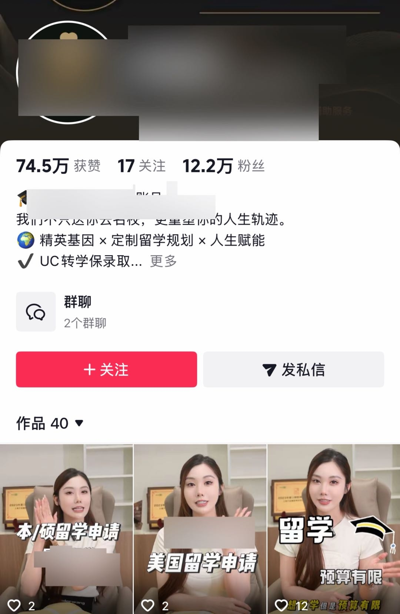
通过主页判断举例
</column><column width-ratio="0.760363">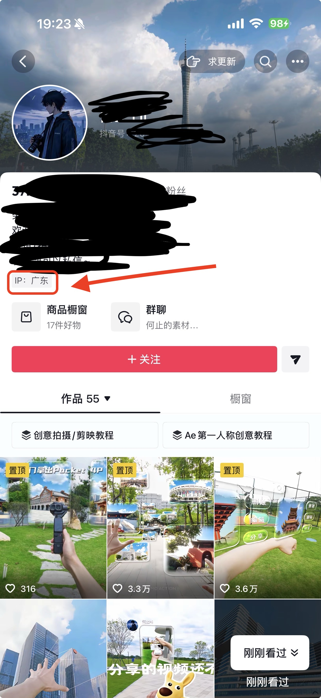
通过IP地址判断是否为本校及附近学生示例
</column></grid></li></ul></td></tr><tr><td vertical-align="middle"><b>及时维护群内秩序</b></td><td><b>发现广告刷屏、攻击骚扰或泄露隐私</b><b>、冒充官方账号发言</b><b>等内容，管理员应及时撤回。</b> 并按“提醒 → 警告 → 移出”处理。诈骗、恶意广告、严重骚扰或隐私泄露等，可直接移出。<grid><column width-ratio="0.246678">
营销号、诈骗账号、举例
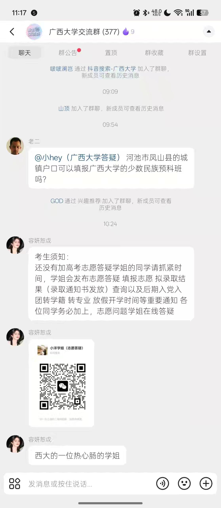</column><column width-ratio="0.209116">
确认是冒充账号后立即移出群聊，并同步在群内提醒，防止错误信息扩散。案例：
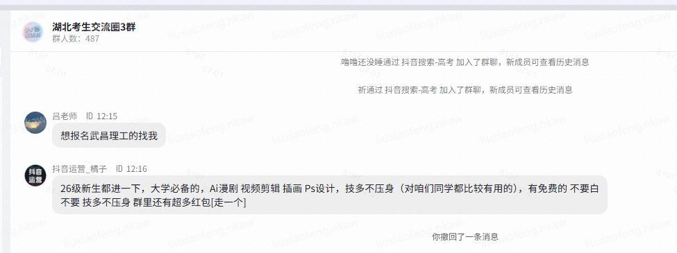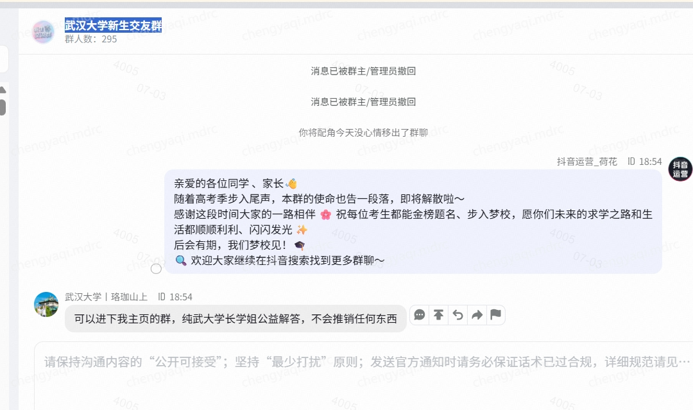

</column><column width-ratio="0.250000">
撤回群消息权限具体操作
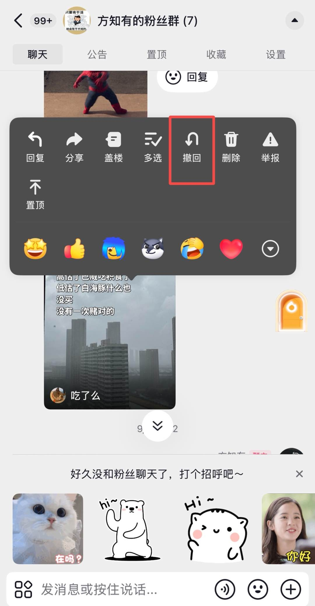</column><column width-ratio="0.294206">
<em>广告信息处理话术：</em>
<blockquote>
<em>@昵称，你刚才发布的内容含有广告及无关引流信息，已撤回。群内不允许发布此类内容，请勿再次发送；重复违规将被警告或移出群聊。如有疑问，可以私信管理员沟通。</em>
</blockquote>

</column></grid> <em>**根据历史Case营销号和诈骗账号，挑晚间薄弱时间，在群里发兼职广告、虚假志愿填报服务、诈骗链接等违规内容，大家发现需要第一时间清理。部分账号会冒充官方运营人员在群里发消息，误导用户判断，影响群内信任度。</em></td></tr></tbody></table>

## 群基础运营功能

<table><colgroup><col/><col/><col/><col/></colgroup><tbody><tr><td><b>功能说明</b></td><td colspan="3"><b>功能展示</b></td></tr><tr><td><b>群管理：</b> <b>邀请群成员、移除群成员、群成员标签”</b>功能，维护成员秩序、控制群聊质量。</td><td><grid><column width-ratio="0.510085">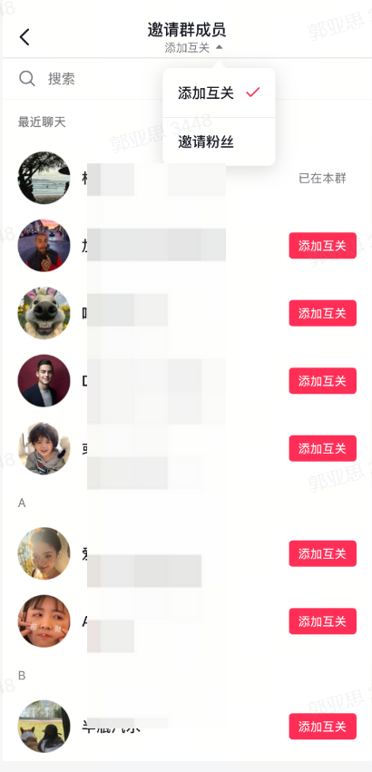

</column><column width-ratio="0.489915">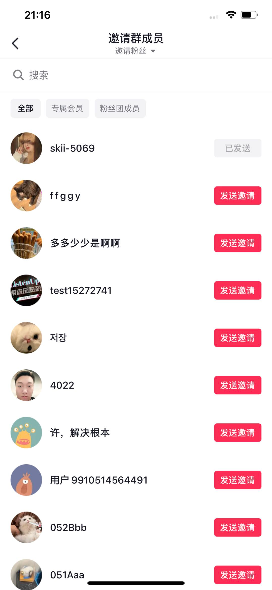</column></grid></td><td>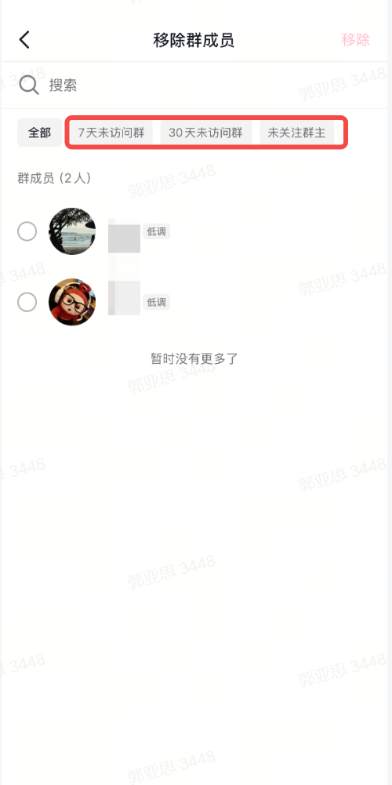</td><td><grid><column width-ratio="0.500000">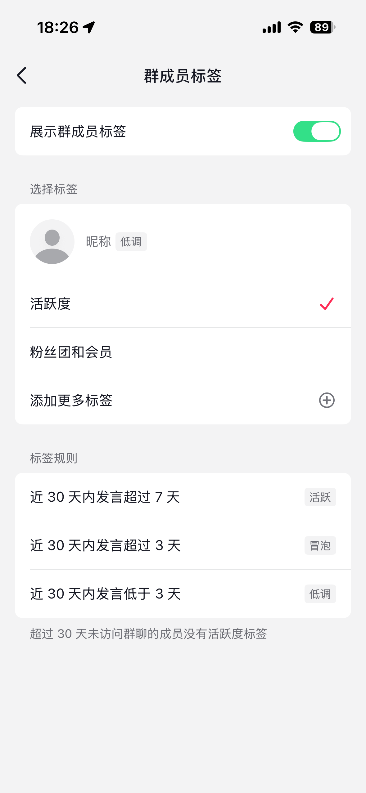</column><column width-ratio="0.500000">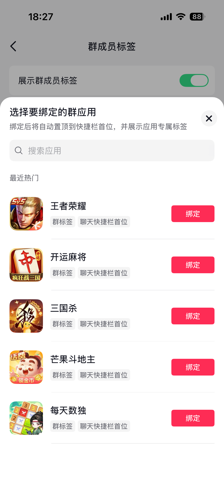</column></grid></td></tr><tr><td><b>群消息：</b> 增加<b>“群消息投稿、消息盖楼等”</b>功能，配合<b>点赞、重新编辑、撤回、复制、分享和置顶</b>等基础功能，可让优质群内容可进一步变成好故事，让更多人看见。</td><td colspan="2"><grid><column width-ratio="0.343056">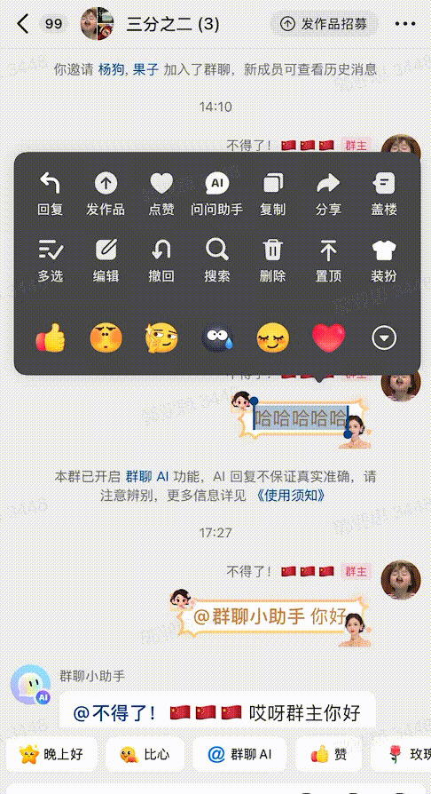</column><column width-ratio="0.327263"></column><column width-ratio="0.329681">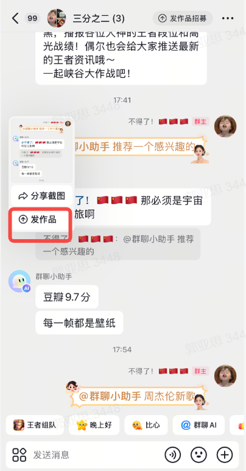</column></grid></td><td><grid><column width-ratio="0.500000">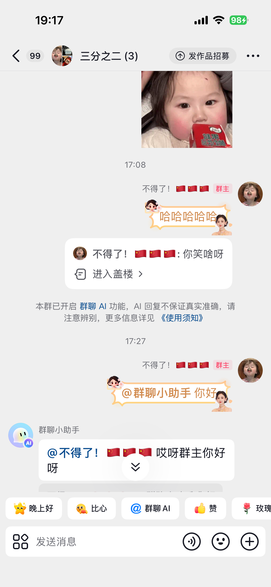</column><column width-ratio="0.500000">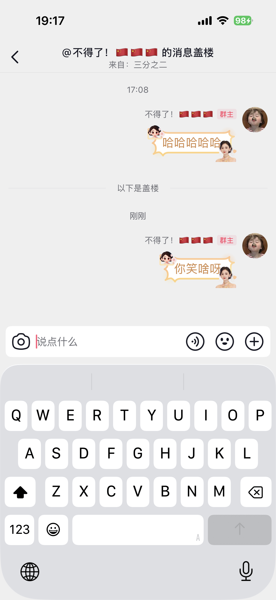</column></grid></td></tr></tbody></table>

## 配置完成后，发布启动消息并跟进交流

以下话术可根据个人风格调整，请替换姓名、学校等信息，活动内容以项目组最新安排为准。

<table><colgroup><col/><col/></colgroup><tbody><tr><td vertical-align="middle"><b>运营事项</b></td><td vertical-align="top"><b>具体操作与提示</b></td></tr><tr><td vertical-align="middle"><b>自我介绍与社群说明</b></td><td vertical-align="top">让成员知道谁在负责、这里能参与什么。比如：<blockquote>
<em>哈喽大家好～我是【学校】的【姓名】，也是本群的运营人，负责日常交流和活动对接。有问题、建议，或者想一起组织活动，都可以找我聊！本群由抖音校园官方创建，群主是「WowLand官方账号」，我负责具体运营。</em>  <em>欢迎加入WowLand，成为 Wow好奇星人！这里可以一起学AI、做作品、聊职业经验，也会有同校、跨校的线下活动，认识一起学习、创作和做事的伙伴。</em>  <em>后续活动招募、报名安排、学习资源与社群专属权益，都会在群内发布。 建议置顶群聊、开启消息提醒，别错过感兴趣的机会。</em>  <em>我自己最近在【分享一项真实兴趣或正在做的事】。也欢迎大家介绍一下年级、兴趣，以及这学期想尝试什么～</em>
</blockquote></td></tr><tr><td vertical-align="middle"><b>活动方向介绍与兴趣收集</b></td><td>介绍活动方向，邀请成员说出具体需求。比如：<blockquote>
接下来，WowLand会陆续开展这三个方向的活动，先看看你对哪个感兴趣👇  1️⃣ 抖音AI创变者计划｜让创意照进现实

AI产品共学、3D世界创作、AI社交体验、行业专家结对、主题黑客松，一起把想法做成作品。  2️⃣ WowLand成长现场｜向世界生长，向自己扎根

听前辈分享职业经验，参加轻量有趣的Wow行动，也在线下交流聚会中认识新朋友。  3️⃣ 野生创作Camp｜你看见了世界，世界就会看见你

探访不同的人生故事、记录成长时刻，参与Wow Design，一起设计表情包、文创等。  你最想参加哪个？具体想做什么？ 比如“想用AI做一个小程序，但不知道怎么开始”，或者“想参加线下交流，也愿意帮忙组织”。这些方向之外的想法，也欢迎说！  具体活动时间和报名方式会陆续发布。我们也会结合大家的兴趣，选择适合本群开展的活动。
</blockquote></td></tr><tr><td vertical-align="middle"><b>回应成员、连接伙伴</b></td><td>回应成员的具体兴趣，帮助有共同方向的人认识彼此，不只回复“欢迎”。 例如：“你也在学AI剪辑呀，刚才【昵称】也提到了，可以聊聊各自在做什么！”</td></tr><tr><td vertical-align="middle"><b>追问需求、邀请协助</b></td><td>问清楚成员想学什么、做什么、遇到什么困难； 有人愿意帮忙时，进一步沟通擅长的事、可投入时间和具体分工。 例如：“你想做哪一类小程序？已经开始尝试了，还是想先找人一起学？” “你更想参与活动策划、现场组织，还是内容记录？”</td></tr><tr><td vertical-align="middle"><b>整理反馈、明确下一步</b></td><td>记录大家关心的主题、具体问题及协助意愿，同步给项目组。 有确定安排后，回群说明活动内容、时间和参与方式；未确定的如实说明，不提前承诺嘉宾、名额或权益。</td></tr></tbody></table>

# 🚩 社群招新&冷启

<callout emoji="💬">
**你需要在社群试运营30天内完成，至少达到100名真实成员。**
</callout>

常设群要长期承接成员、活动和项目，首先需要聚集一批真实、愿意参与的人。

9月是新学期开学和学生集中加入社群的关键时间，也是后续秋季项目能够顺利开展的基础。

项目组提供统一招募素材、活动方案及资源支持，社群运营人负责结合本校情况开展宣传、组织招新，并做好成员入群后的交流与参与引导。

<table><colgroup><col/><col/><col/></colgroup><tbody><tr><td><b>线上招募（所有人）</b> 平台提供统一招募物料。每个社群结合自己的名称、目标成员和所在学校，通过校园墙、班级社团、朋友圈等渠道持续招募。<grid><column width-ratio="0.365044">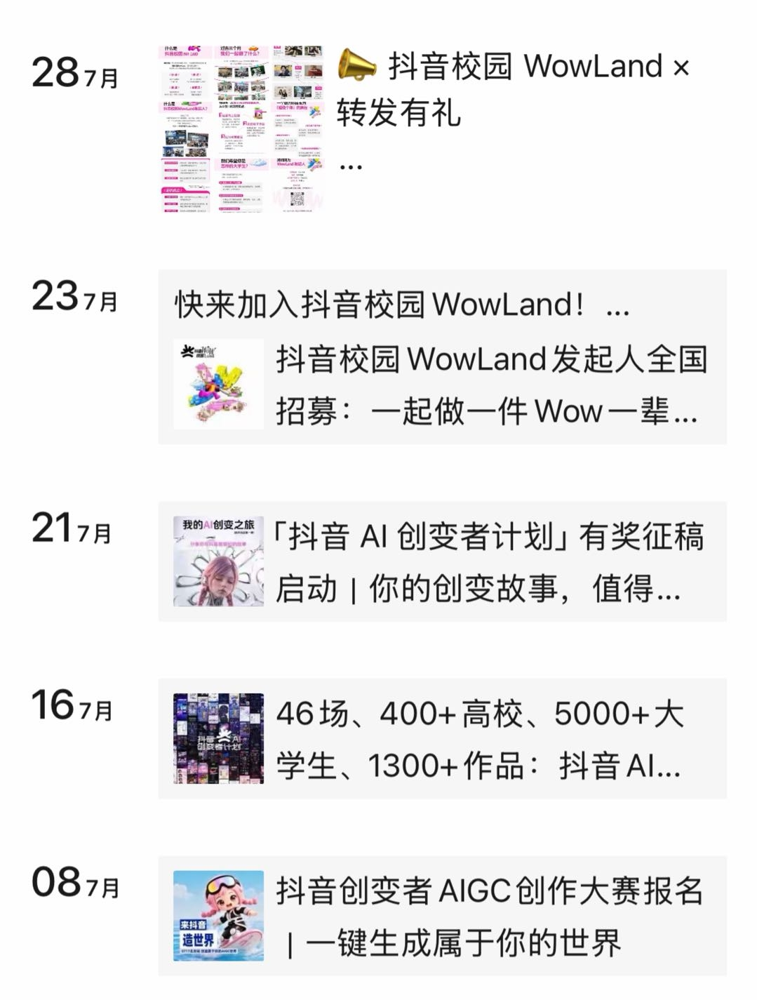</column><column width-ratio="0.267143">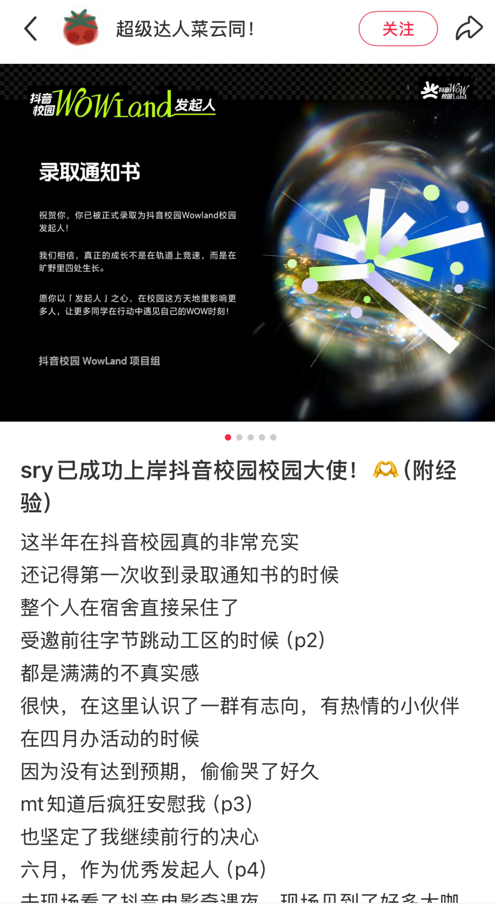</column><column width-ratio="0.367814">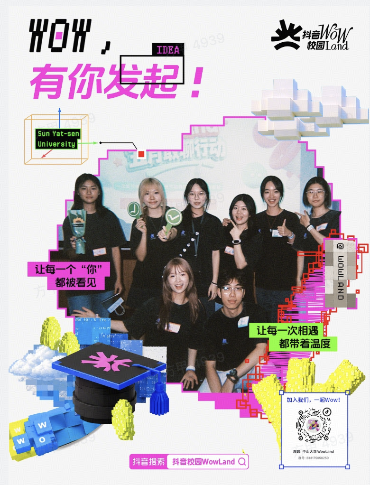</column></grid></td><td><b>线下推广</b> 百团大战及校园摆摊。在学生集中的地方展示WowLand定位、秋季项目和加入方式，现场介绍并邀请感兴趣的人进群。<grid><column width-ratio="0.471438">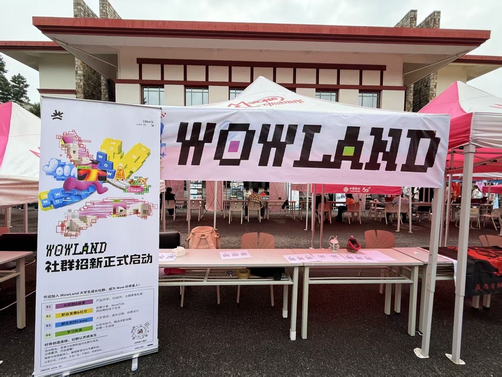</column><column width-ratio="0.528562">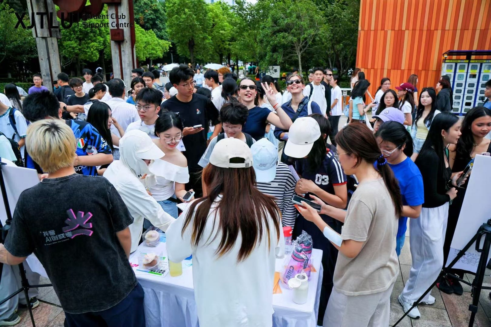</column></grid></td><td><b>线下招募宣讲</b> 通过活动画面、成员故事、秋季项目和社群权益，让参与者了解加入后能做什么、获得什么，并在现场完成入群。<grid><column width-ratio="0.500000">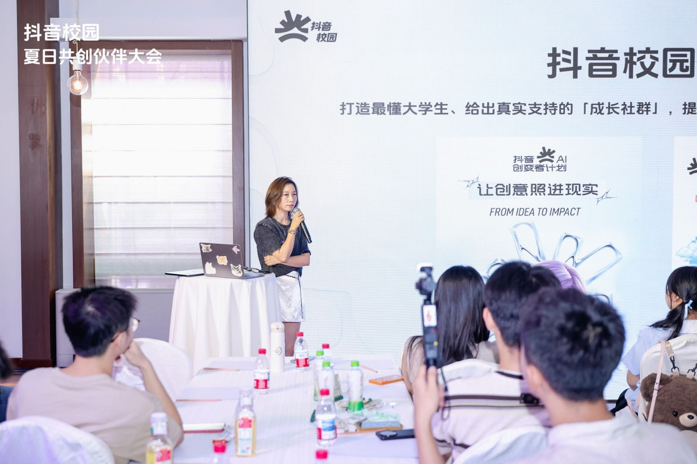</column><column width-ratio="0.500000">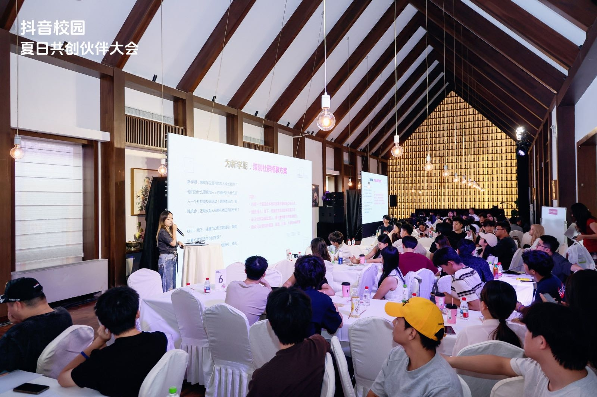</column></grid></td></tr></tbody></table>

## 线上招募方法

### 线上渠道转发

<table><colgroup><col/><col/><col/><col/></colgroup><thead><tr><th vertical-align="middle"><b>渠道</b></th><th vertical-align="top">发布参考方向</th><th><b>具体参考</b></th><th>相关文件及视觉物料</th></tr></thead><tbody><tr><td vertical-align="middle"><b>朋友圈/校园墙</b></td><td vertical-align="top"><b>-偏宣发版</b> 文案建议包含： WowLand介绍+在校专属社群里有什么+加入可获得什么？ <em>【可转发推文/海报/社群二维码等】</em> <b>-偏情绪感染款</b> 文案建议包含： 往期真实体验+获得的成长以及福利等，如<em>往期活动群像照片+社群二维码等（二维码放中心位置）</em></td><td><b>正文：</b> 想在大学里做点真实的事，认识一群能一起行动的人？ 欢迎加入 <b>WowLand 大学生成长社群</b>！在这里，你可以： 🤖 参加 AI 产品共学、3D 创作、专家结对和主题黑客松 🌱 听前辈分享，参与 Wow 行动及同校／跨校线下交流 🎬 加入野生创作 Camp，记录成长、参与创意设计 📚 获取持续更新的 AI 资讯、实用技巧和求职经验 想学新东西、做出自己的作品、找到同行伙伴，欢迎扫描下方二维码加入社群👇 【配图：自己的社群永久二维码】 <b>评论区补充：</b> 📎 扫描下方二维码加入我们学校的专属社群，活动招募、学习资源都会在群里持续更新～</td><td><b>官方推文：</b><a href="https://mp.weixin.qq.com/s/T3fwTap90Vr6gZEEx79HWg?version=5.0.8.70666&amp;platform=mac&amp;from=industrynews">新学期的成长副本，来 WowLand 一起开启</a> <b>转发切图：</b><grid><column width-ratio="0.333333">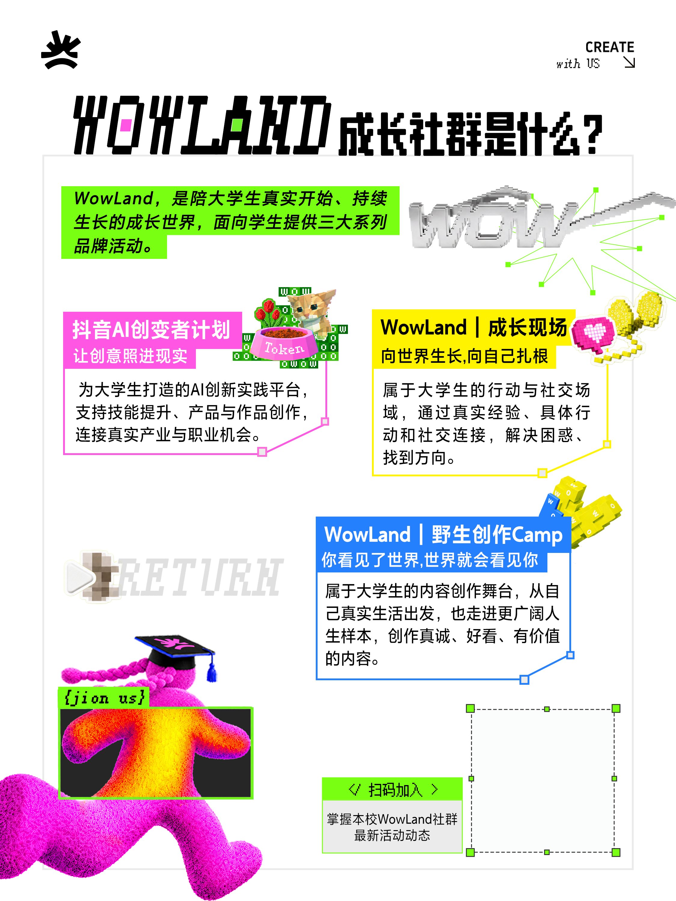</column><column width-ratio="0.333333">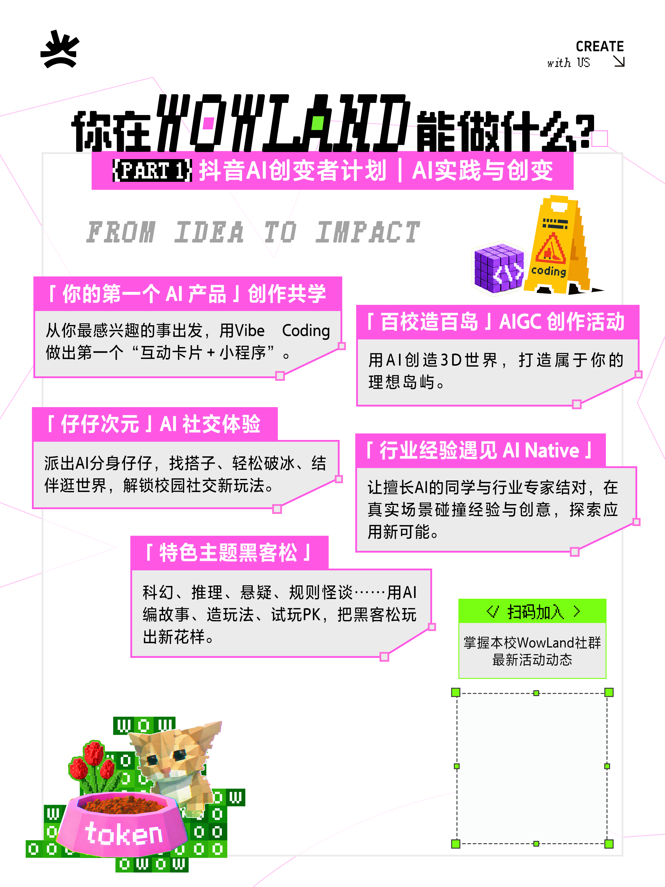</column><column width-ratio="0.333333"></column></grid><grid><column width-ratio="0.250000">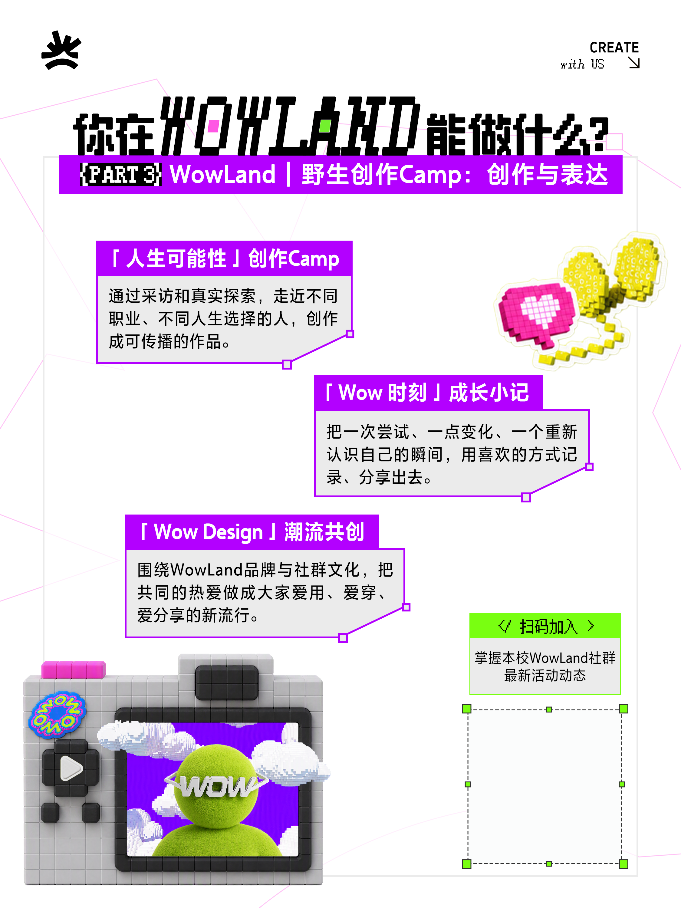</column><column width-ratio="0.250000">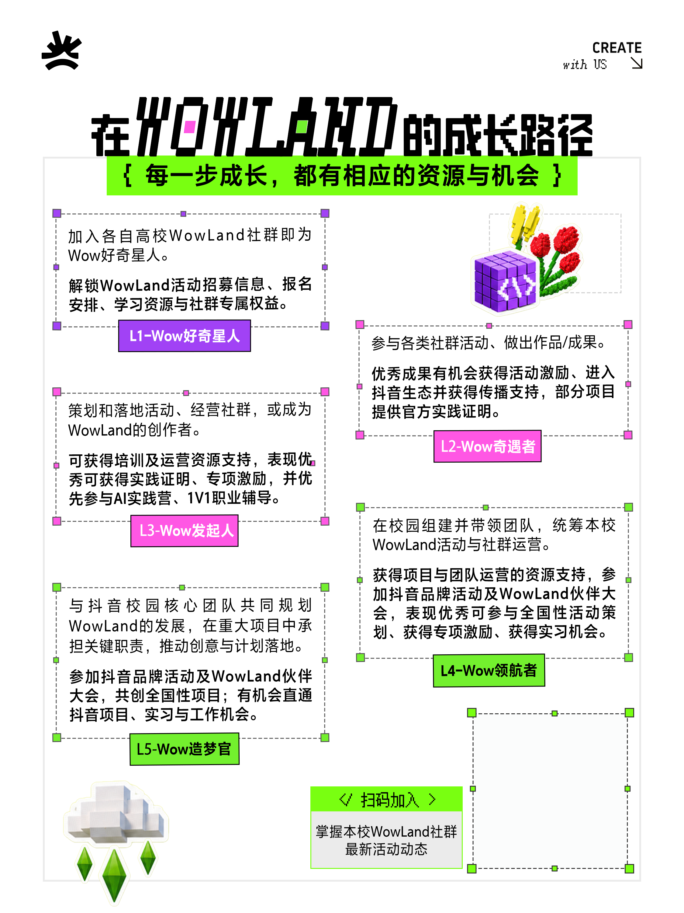</column><column width-ratio="0.250000">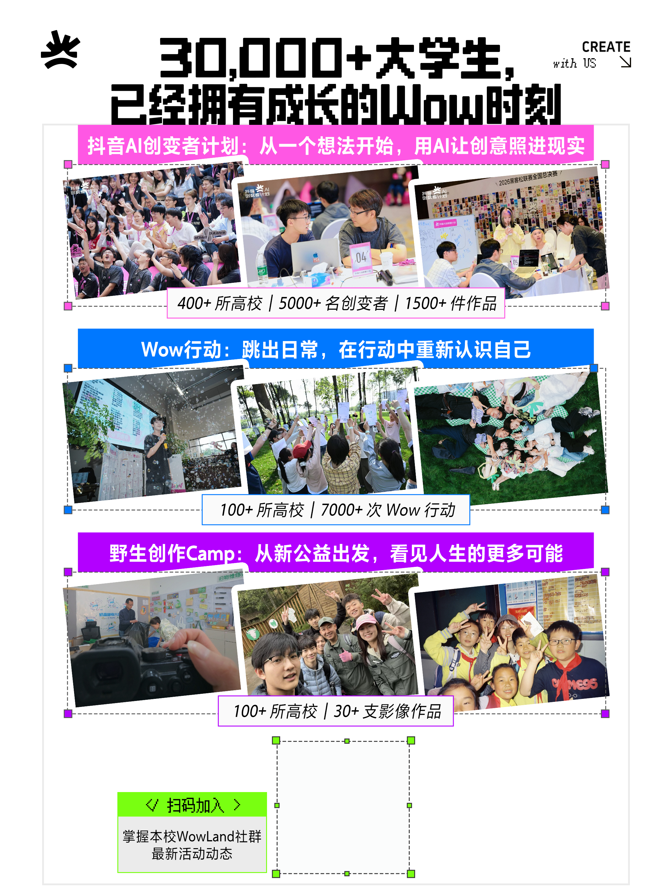</column><column width-ratio="0.250000">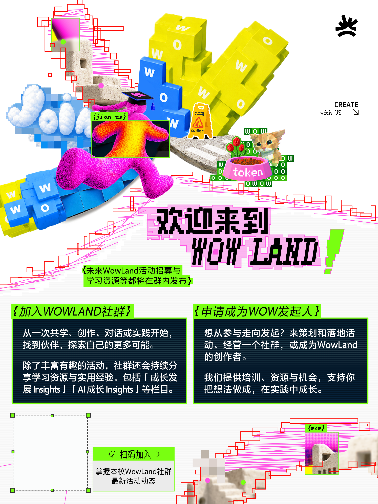</column></grid></td></tr><tr><td vertical-align="middle"><b>群聊</b></td><td vertical-align="top">实习资源群/部门工作群/社团群/活动群等 <em>ps:</em><em> </em><em>建议经管理员同意后，围绕群成员的兴趣介绍相关活动，不反复刷屏。</em></td><td>欢迎加入WowLand大学生成长社群，成为Wow好奇星人！这里有： 🤖 AI实践&amp;创变：产品共学、3D创作、主题黑客松等 🌐 职业发展&amp;社交：前辈分享、Wow行动、同校跨校线下交流 🎬 野生创作Camp：人生探访、成长记录、创意设计 📚 学习资源：AI资讯技巧、精选求职攻略、前辈一手经验 活动报名、资源与社群权益均会在群内发布，随参与和贡献深入，还可以解锁新身份与专属机会哦～ 如果你想学 AI、做作品、参加真实项目，或者单纯想找到一群能一起学习、创作和做事的人，欢迎扫描下方二维码，加入 <b>「XX大学 WowLand」抖音社群</b>👇 <a href="https://mp.weixin.qq.com/s/T3fwTap90Vr6gZEEx79HWg?version=5.0.8.70666&amp;platform=mac&amp;from=industrynews">新学期的成长副本，来 WowLand 一起开启</a> <b>配图</b>：【自己的社群永久二维码】</td><td></td></tr><tr><td vertical-align="middle"><b>小红书</b></td><td rowspan="2" vertical-align="top"><b>-文案方向</b><ol><li seq="1">自发的ugc内容：活动感悟/成长收获/讲解口播......</li><li>正式宣发类:活动介绍文案</li></ol> <b>-配图方向</b> <em>生命力照片+群像/官方海报等</em> <b>-评论区/私信处</b> 引导进入本校WowLand社群</td><td>**参考内容 <a href="https://www.xiaohongshu.com/discovery/item/6a69a64f000000001c00c7e4?source=webshare&amp;xhsshare=pc_web&amp;xsec_token=ABFBoWtrcJa1w2fwWF1KJlkSXYvoRenj5vO9nu7IhprWo=&amp;xsec_source=pc_share"><em><u>为什么我会建议大学生都去报名抖音wowland </u></em></a> <a href="https://www.xiaohongshu.com/discovery/item/69e36b75000000001a02dc1e?source=webshare&amp;xhsshare=pc_web&amp;xsec_token=ABt1Ej4NnfkgNZ_OOECNyq8_GpyeWrXeNbxpQq6u5Qdq8=&amp;xsec_source=pc_share"><em><u>我们的青春真的只剩一份好看的“简历”吗？ </u></em></a></td><td></td></tr><tr><td vertical-align="middle"><b>抖音</b></td><td><em>**</em><em>参考内容</em> <a href="https://v.douyin.com/W2AtOTxzMkQ/"><em><u>我决定不再“着急长大”</u></em></a> <a href="https://v.douyin.com/hPQRlyf4_Pw/"><em><u>救命！花狮大突然进入「游戏副本」模式？</u></em></a> 评论区：<em>点击即群聊即可加入</em><em>XX大学WowLand</em><em>专属社群～</em> <em>置顶本校WowLand抖音群入口</em></td><td></td></tr></tbody></table>

### 公众号和其他渠道宣发

学校公众号/个人公众号发文前均须先过审核：<cite doc-id="BMuqw2W9vi5Bazke7fUcrcepnjc" file-type="wiki" title="WowLand9月招新活动台 &amp; 二创物料审核表单" type="doc"></cite>

每天 **10:30、18:00** 集中 review，紧急需求可提交后私戳同步<cite type="user" user-id="ou_47c9ac82a1dc4e90061713b821400da1" user-name="方甲"></cite><cite type="user" user-id="ou_cbb7d1e0048815555f5cb8fffd05086d" user-name="曾振琳"></cite>

**如果涉及其他宣发渠道，如公众号/校园墙等涉及费用，可提供具体方案，项目组根据实际情况报销。**

**\*如需校园付费渠道的宣发推广费用，如校园墙、社群等 需提供真实支付凭证 和相关类目发票作为替票至付款人 方能给予报销。**

## 线下招募方法

### **社团集中招新**

确认校内许可、摊位和执行人员，设计轻量互动；现场介绍社群、引导扫码，活动后跟进入群成员。

**我们会提供什么？**

- 官方标准物料一套*（30份物料礼品➕2件文化衫➕易拉宝）+ 物料花费报销（如打印等报销，需审核）*
- 活动方案模版：<cite doc-id="OEaDddKazodLZ0xrLY1ciKWbnAf" file-type="docx" title="【xxx群聊-社团集中招新】方案信息" type="doc"></cite>

<grid><column width-ratio="0.500000">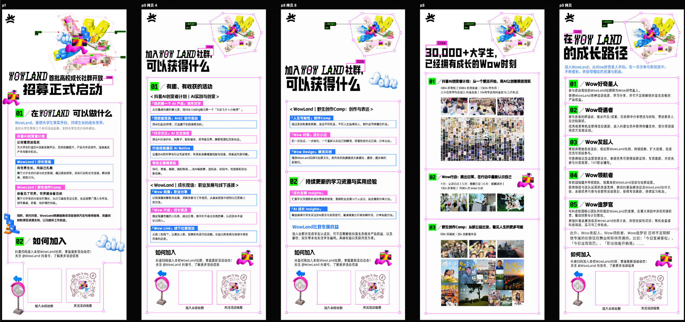</column><column width-ratio="0.500000"><figure view-type="Card"><source name="易拉宝-总（定稿）.psb" size="434590736" token="UHSPbwTahoUpdkxKBZfc1NVznNg"/></figure>

</column></grid>

### **线下宣讲、招募沙龙**

确认场地、时间和分工，完成宣传邀约、主持及现场组织。

通过项目介绍、成员故事和交流，让大家了解社群，也有次线下认识彼此的机会。建议9月各社群组织一次。

如果可以做一场小的宣讲会：   

- 官方标准物料一套*（30份物料礼品➕2件文化衫➕易拉宝）*
- 宣讲会的PPT和整体的流程模版，可根据需求协助匹嘉宾*（需评估）*
- 活动经费报销*（根据实际的项目方案审批预算，其中包含 打印/场地等必要费用）*
- 活动方案模版：<cite doc-id="ZG0lwj15YiT6yTkbwZEcCNk5n9b" file-type="wiki" title="【xx群聊】9月招新 宣讲会-模版" type="doc"></cite>

<figure view-type="Card"><source name="0916WowLand_2026秋季宣讲_无视频版.pdf" mime="application/pdf" size="9091057" token="TGlEb3pwqovJA9xo73KcmbuUnn1"/></figure>

Ps:请在放映P6[抖音AI创变者计划：影像与回顾]时播放；请在放映P9[Wow行动：影像与回顾]时播放

<grid><column width-ratio="0.333333"><figure view-type="Card"><source name="抖音AI创变者计划2026黑客松联赛.mp4" mime="video/mp4" size="1409717324" token="IA0UbWVnjorArQxp5I1cndJWnRg"/></figure></column><column width-ratio="0.333333"><figure view-type="Card"><source name="同学创作的总决赛视频.mov" mime="video/quicktime" size="2003131487" token="MWh8bD8kJoOWbWxTmNRc1KLjnTb"/></figure></column><column width-ratio="0.333333"><figure view-type="Card"><source name="WowLand春季学期回顾.mp4" mime="video/mp4" size="938818308" token="P0rJbcNfVoVXNYxUQlTcSbU1ntf"/></figure></column></grid>

<callout emoji="💭">
**具备组织经验和校内资源的团队申请。**
能够承办院级、校级活动/200人以上宣讲会，提交完整策划案，说明校内支持、执行团队及所需资源。
除了上方资源外，需要写清晰整体的招新宣讲策划案。
- 根据实际情况评估活动经费*（大型宣讲会预算将根据方案评估）*
- 提供与校方&院方&老师的合作/沟通交流*（需评估）*
</callout>

**‼️\*请同学们将写完的方案统一提交至：<cite doc-id="BMuqw2W9vi5Bazke7fUcrcepnjc" file-type="wiki" title="WowLand9月招新活动台 &amp; 二创物料审核表单" type="doc"></cite>（**文档密码**：**WowLand9）**等待审核**

项目组将集中在每日**11:30｜15:30｜18:30** 集中 review，紧急需求可提交后私戳同步<cite type="user" user-id="ou_47c9ac82a1dc4e90061713b821400da1" user-name="方甲"></cite><cite type="user" user-id="ou_cbb7d1e0048815555f5cb8fffd05086d" user-name="曾振琳"></cite>

方案若有需要修改的地方，我们将在你的文档上直接**评论**，为了避免miss消息，请打开飞书消息提醒哦

## 品牌视觉物料和高校审核文件

<table><colgroup><col/><col/><col/></colgroup><thead><tr><th vertical-align="middle">物料名称</th><th>物料内容</th><th>印刷文件</th></tr></thead><tbody><tr><td vertical-align="middle"><b>宣传片</b></td><td colspan="2"><grid><column width-ratio="0.333333"><figure view-type="Preview"><source name="抖音校园wowland—宣传片.mp4" mime="video/mp4" origin-height="1080.000000" origin-width="1920.000000" size="938818308" token="GqNcbQHHoosYAMxdXdicYtZAnbc"/></figure>
Wow行动：影像与回顾
</column><column width-ratio="0.333333"><figure view-type="Preview"><source name="抖音ai创变者-宣传片.mp4" mime="video/mp4" origin-height="1080.000000" origin-width="1920.000000" size="1409717324" token="YpxYbh5ABol0IRx1nHKc5EhJnD6"/></figure>
抖音AI创变者计划联赛回顾
</column><column width-ratio="0.333333"><figure view-type="Preview"><source name="黑客松1.mov" mime="video/quicktime" origin-height="1080.000000" origin-width="1920.000000" size="2003131487" token="DnR4bAVZpoohU8xxqlscaMPwn6g"/></figure>
同学创作的总决赛记录视频
</column></grid></td></tr><tr><td rowspan="2" vertical-align="middle"><b>海报</b></td><td rowspan="2"><grid><column width-ratio="0.274397">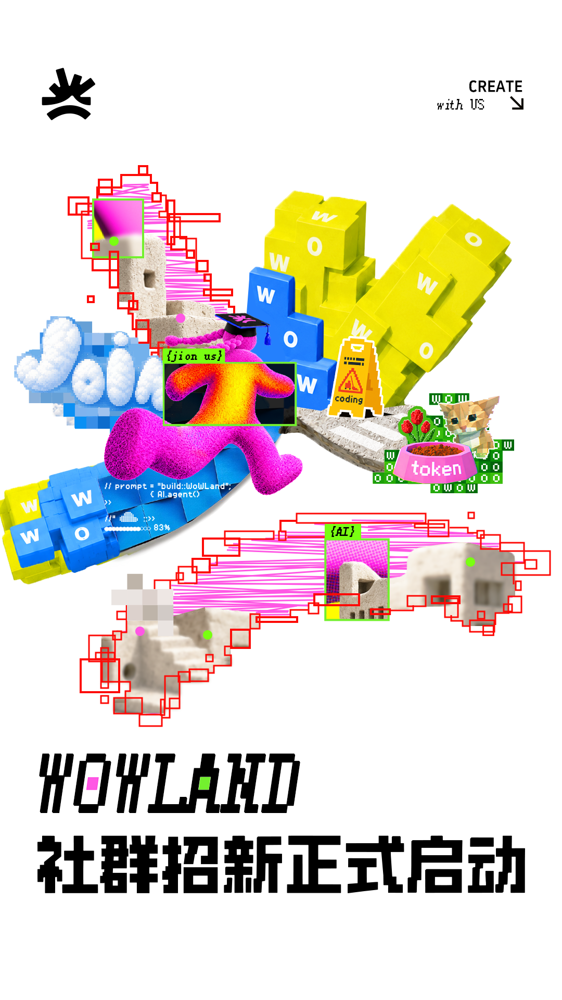</column><column width-ratio="0.725603">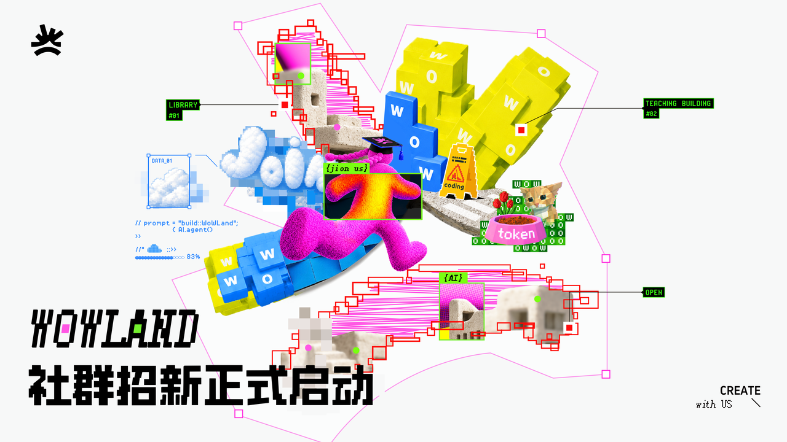</column></grid></td><td rowspan="2"><figure view-type="Card"><source name="0911海报竖版.psd" mime="image/vnd.adobe.photoshop" size="78220835" token="XbMwbnv5goPDI4x5rBKcINLmn9c"/></figure><figure view-type="Card"><source name="0911主kv-RGB.psd" mime="image/vnd.adobe.photoshop" size="704630761" token="B1H0bkygZok9ONxQcipcR5Gxnch"/></figure><figure view-type="Card"><source name="横版KV（CMYK）.png" mime="image/png" size="971488" token="Niflb6AW8orwmmxxty0cmdyFn4f"/></figure></td></tr><tr></tr><tr><td><b>切图海</b><b>报</b></td><td><grid><column width-ratio="0.333333">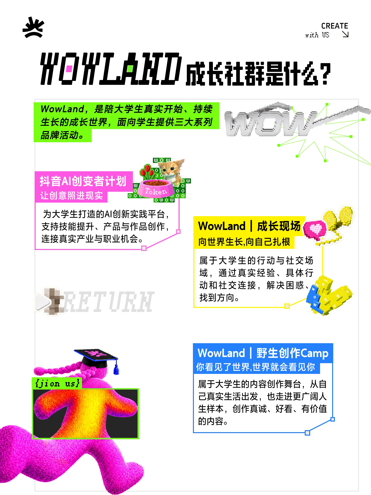</column><column width-ratio="0.333333">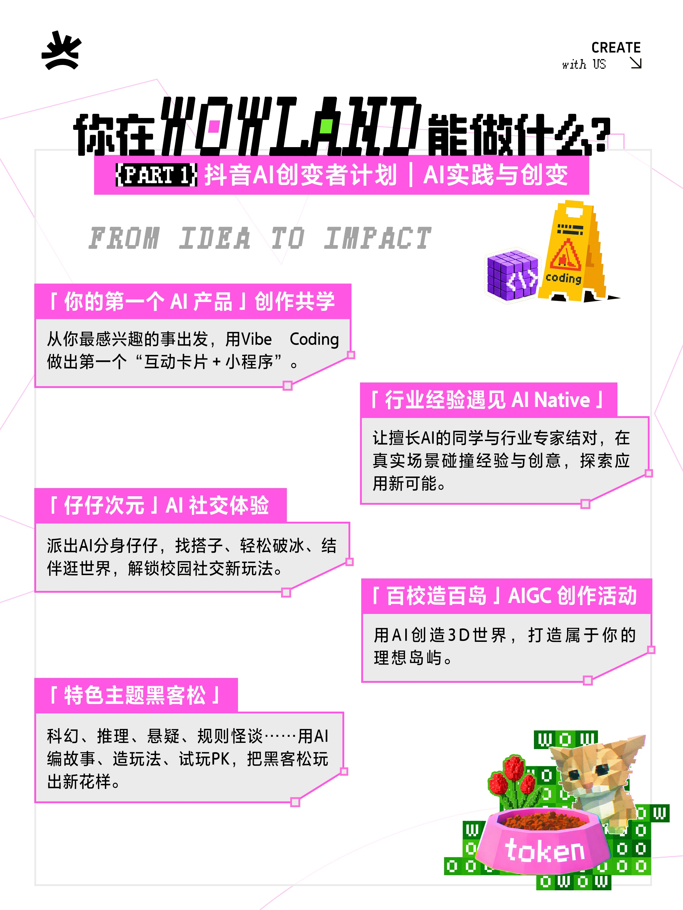</column><column width-ratio="0.333333">![图片是WowLand社群试营业执行手册中关于社群招新&amp;冷启部分的内容。上方标题为“你在WowLand能做什么？”，并有“[PART 2] WowLand | 职业发展与线下连接”字样。下方分为“「Wow前辈」职业分享”“「Wow行动」成长挑战”“「Wow Link」线下社群活动”三个板块，分别介绍资深嘉宾职业分享、完成轻量有趣任务、线下社群活动等内容，旨在帮助成员在WowLand社群中成长。](_assets/NYA9bL1dhowR94xDm5PcXAKDn4c.jpg)</column></grid><grid><column width-ratio="0.250000"></column><column width-ratio="0.250000">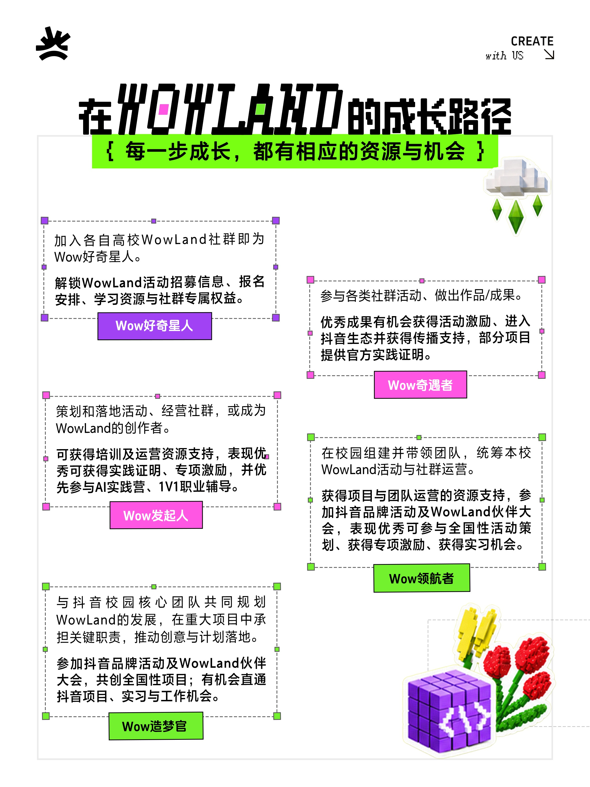</column><column width-ratio="0.250000"></column><column width-ratio="0.250000">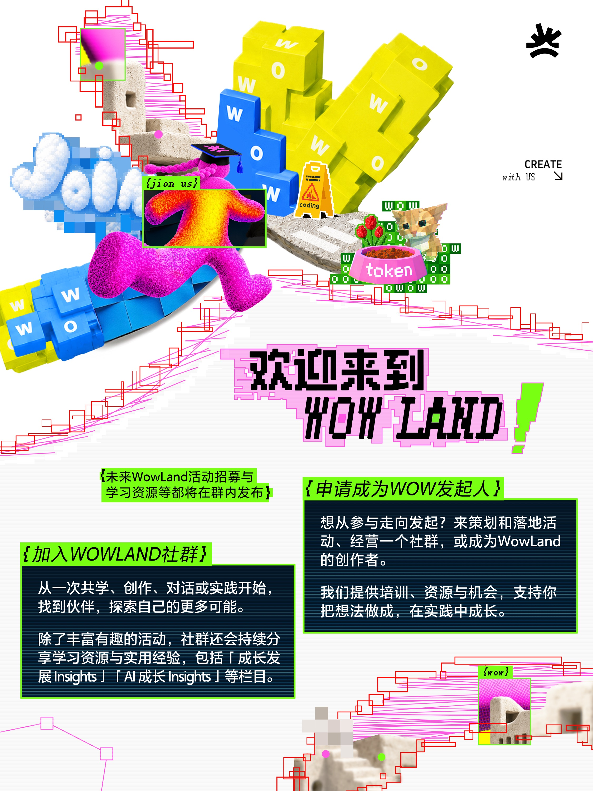</column></grid></td><td><grid><column width-ratio="0.500000"><figure view-type="Card"><source name="P1社群定位0917.psd" mime="image/vnd.adobe.photoshop" size="71891699" token="Hv3rbIpnyoErRAxh4DTcZ67cnic"/></figure></column><column width-ratio="0.500000"><figure view-type="Card"><source name="P2品牌活动10917.psd" mime="image/vnd.adobe.photoshop" size="67529588" token="GXLCb2cGxoztLjx41FFceJ4Lnxc"/></figure></column></grid><grid><column width-ratio="0.500000"><figure view-type="Card"><source name="P3品牌活动20917.psd" mime="image/vnd.adobe.photoshop" size="77046507" token="E1hWbU0EwobWiMxnRvYcUKQsngf"/></figure></column><column width-ratio="0.500000"><figure view-type="Card"><source name="P4品牌活动30917.psd" mime="image/vnd.adobe.photoshop" size="76715906" token="Y6f5bbi7to023uxUVetc0bPFnh7"/></figure></column></grid><grid><column width-ratio="0.500000"><figure view-type="Card"><source name="p5成长架构0917 .psd" mime="image/vnd.adobe.photoshop" size="17566894" token="ObelbObctome32xDAquc9ODonBb"/></figure></column><column width-ratio="0.500000"><figure view-type="Card"><source name="p6回顾0917.psd" mime="image/vnd.adobe.photoshop" size="49745882" token="BPJJbO7GPopzKlxaCu0cXLornUd"/></figure></column></grid><figure view-type="Card"><source name="p7社群加入方式0917.psd" mime="image/vnd.adobe.photoshop" size="317765489" token="T13kb8mTTo87bIxlbThcWbZKnTe"/></figure></td></tr><tr><td><b>总宣文章</b></td><td colspan="2"><b>官方推文</b>：<a href="https://mp.weixin.qq.com/s/T3fwTap90Vr6gZEEx79HWg?version=5.0.8.70666&amp;platform=mac&amp;from=industrynews">新学期的成长副本，来 WowLand 一起开启</a></td></tr><tr><td><b>易拉宝文件</b></td><td> 共5张物料，适用于各类线下宣讲场景。易拉宝标准打印尺寸为80cm × 200cm。 若时间紧急需自己制作易拉宝时，请同步打印本校抖音社群二维码，并粘贴在左下角「加入本校社群」上方的空白区域内。</td><td><figure view-type="Card"><source name="易拉宝-总（定稿）.psb" mime="application/x-photoshop" size="434590736" token="WyJ2bv1dYodVJsxqSnGcEVn2nce"/></figure></td></tr><tr><td vertical-align="middle"><b>品牌字体</b> -标题1/2</td><td colspan="2"><figure view-type="Card"><source name="方正像素12.TTF" mime="font/ttf" size="1895036" token="RIPMbpWkvoE3ZwxYXckcntZ7nAc"/></figure></td></tr><tr><td vertical-align="middle"><b>品牌字体</b> -特殊字</td><td><grid><column width-ratio="0.586638">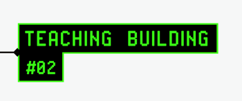</column><column width-ratio="0.413362">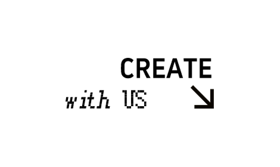</column></grid></td><td><grid><column width-ratio="0.500000"><figure view-type="Card"><source name="DouyinSansBold.otf" mime="font/otf" size="2082964" token="Sy1GbStU0oPUYrxyvy3cpIDUnrd"/></figure></column><column width-ratio="0.500000"><figure view-type="Card"><source name="PixelOperator.ttf" mime="font/ttf" size="20904" token="Mrqhb9V6mo5QN8xO6QKcqjGintc"/></figure></column></grid></td></tr><tr><td vertical-align="middle"><b>品牌色</b></td><td>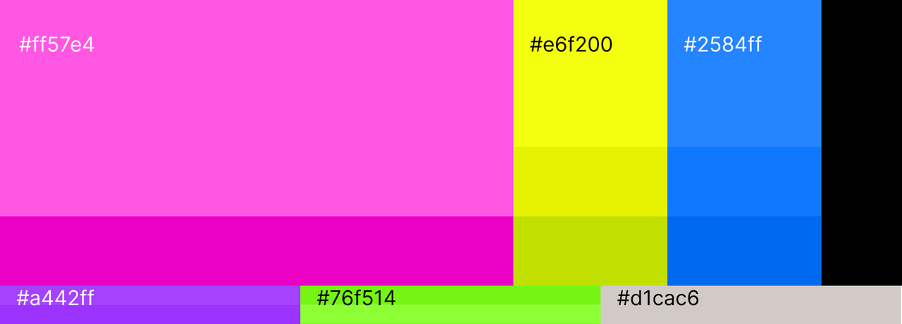</td><td>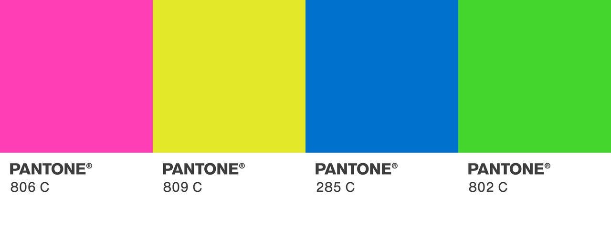 <b>印刷建议</b></td></tr><tr><td><b>品牌头像</b></td><td colspan="2"><figure view-type="Card"><source name="wowland头像.zip" mime="application/zip" size="46163676" token="TaIFbUs3poHn63x8hs8cquMBnIh"/></figure> <em>*大家可以从头像文件夹中挑选喜欢的款式，设置为抖音社群头像～</em></td></tr><tr><td vertical-align="middle"><b>宣讲ppt</b></td><td colspan="2"><figure view-type="Card"><source name="WowLand_PPT模板.pptx" mime="application/vnd.openxmlformats-officedocument.presentationml.presentation" size="33309467" token="FPE5b4RT9olbpIxxiYwcCpNqncg"/></figure><figure view-type="Card"><source name="0916WowLand_2026秋季宣讲_无视频版.pdf" mime="application/pdf" size="9091057" token="B63Gbmz2yoZUfixsHhDcRaoEnfg"/></figure> <b>Ps:请在放映</b><b>P6</b><b>[抖音AI创变者计划：影像与回顾]时播放</b><figure view-type="Card"><source name="抖音AI创变者计划2026黑客松联赛.mp4" mime="video/mp4" size="1409717324" token="Wb6NbYIVdog6vgxbl51cuZWknlc"/></figure> <b>请在放映</b><b>P9</b><b>[Wow行动：影像与回顾]时播放</b><figure view-type="Card"><source name="WowLand春季学期回顾.mp4" mime="video/mp4" size="938818308" token="PUB5b2iyuoMZQkxpDjmcYoZpn5g"/></figure></td></tr><tr><td vertical-align="middle"><b>官方文件</b></td><td colspan="2"><b><em><u>【参考话术】</u></em></b> <b>WowLand秋季招新宣讲会活动及场地申请</b> 尊敬的老师： 您好！我是WowLand项目的本校学生联系人【姓名】。 新学期，我们拟在本校举办一场WowLand秋季招新宣讲会，向有兴趣的同学介绍秋季实践项目与参与方式，并邀请往期参与者分享真实经历。现希望申请借用校内场地，恳请老师给予指导与支持。 <b>一、活动背景与目的</b> WowLand是由抖音校园运营、面向大学生开展的成长实践与交流项目，通过AI应用实践、职业经验分享、成长主题活动和内容创作，帮助学生发现兴趣、锻炼能力、拓展视野。 本次宣讲会希望让同学们了解秋季有哪些项目可以参与、能够获得哪些学习与实践支持，并通过往期参与者的分享，具体了解从组队、创作到完成成果的过程。 <b>二、本场活动安排</b><ul><li><b>活动名称</b>：WowLand秋季招新宣讲会</li><li><b>拟定时间</b>：【日期、起止时间，可根据学校安排调整】</li><li><b>预计人数</b>：【人数】</li><li><b>参与对象</b>：对AI实践、职业成长、内容创作及校园活动感兴趣的本校学生</li><li><b>学生负责人</b>：【姓名、院系及联系方式】</li><li><b>项目组对接人：</b><b>抖音校园项目组</b><b>douyinclub@bytedance.com</b></li></ul> 拟开展以下环节：<ol><li seq="1"><b>秋季项目介绍</b>：介绍AI共学与创作、职业分享、成长挑战、内容共创等活动，以及相应的参与条件和支持。</li><li><b>往期参与者分享</b>：邀请【拟邀分享人及经历】讲述参与过程、作品成果与个人收获，并与现场同学交流。</li><li><b>参与方式说明与答疑</b>：介绍社群加入、项目报名及Wow发起人申请方式，解答同学们的具体问题。</li></ol> 参与者可自愿了解或登记感兴趣的项目，参加宣讲会不代表必须加入社群或报名后续活动。 <b>三、申请老师支持的事项</b> 希望借用一间可容纳【人数】的教室、会议室或活动室，配备投影设备；如场地需要，也希望协调麦克风使用。 如学校规定允许，恳请协助通过相关学生组织或校内渠道发布活动信息，方便有兴趣的同学自主参加。 具体场地和时间可配合学校安排调整，活动材料、分享人信息及执行方案可提前提交老师审核。 <b>四、活动组织与保障</b><ul><li>本次活动不向学校及参与学生收取任何费用，也不要求学校承担活动经费。</li><li>活动按学校要求履行审批或备案程序，不影响正常教学秩序。</li><li>由学生负责人及协作团队做好报名、签到、现场秩序与人员引导，活动结束后清理并恢复场地。</li><li>如涉及信息登记或现场拍摄，将提前说明用途并征得相关同意；涉及校名校徽及对外宣传的内容，将事先沟通确认。</li><li>如有校外分享人到场，将提前提交相关信息，并按学校要求办理入校手续。</li></ul> 恳请老师对活动安排给予指导，并支持场地申请。如需补充材料，我会及时提供，也可以当面汇报。 感谢老师对学生实践与成长的支持！ 此致 敬礼！ 申请人：【姓名】 院系及年级：【信息】 联系方式：【电话】 申请日期：【日期】 <b><em><u>附件：</u></em></b><figure view-type="Card"><source name="关于抖音校园WowLand的活动说明（高校版）.pdf" mime="application/pdf" size="556037" token="UXhwbNG7GoS8TbxYFEOc4m9znhh"/></figure> <b><em><u>往期活动官媒报道：</u></em></b> <a href="https://news.youth.cn/jsxw/202604/t20260421_16619317.htm">“青春年少好读书——与书的春日奇遇”主题活动启幕_新闻频道_中国青年网</a> <a href="https://reader.gmw.cn/2026-04/22/content_38725449.htm">“青春年少好读书——与书的春日奇遇”主题活动启幕 _光明网</a> <a href="https://mp.weixin.qq.com/s/pQ43MyOPHwUn1vcwab_Pgg">《48小时极限开发！抖音AI黑客松联赛全国总决赛开赛！》</a> <a href="https://mp.weixin.qq.com/s/zBC_pNr_lEss7pSdihAZmw">《24支队伍，5天终极比拼！抖音AI黑客松联赛全国总决赛圆满收官！》</a> <a href="https://hdb.bjhdnet.cn/hdb/content/202608/17/c64072.html">海淀报《展台之间，触摸青年AI的“跳动”力量》</a> <a href="https://hdb.bjhdnet.cn/hdb/content/202608/17/c64071.html">海淀报《48小时，让AI从脑洞变成现实》</a> <a href="https://www.bjhdnet.cn/haidiannews/ctxw/5322303/index.html">海淀新闻《黑客松总决赛海淀收官，为大学生搭建AI实践成长平台》</a> <b><em><u>往期活动报道：</u></em></b> <a href="https://mp.weixin.qq.com/s/pDJNgn0Np2W2VLQty6UMiQ">抖音校园WowLand | 48小时限时行动，这个周末去「遇见很Wow的自己」</a> <a href="https://mp.weixin.qq.com/s/w_fA9LZBLYrWjTw4lg5x-A">423世界读书日｜我们联合全国三十多所高校，开启「与书的春日奇遇」</a> <a href="https://mp.weixin.qq.com/s/za4iTm_-iE8sNUeKMVUzEw">「4月Wow行动」精彩回顾丨48小时，可以发生哪些真实变化？</a> <a href="https://mp.weixin.qq.com/s/hNTF47RtT8dvKyEuD3ZaLw">「5月Wow行动」精彩回顾：连接一个人，原来是在靠近自己</a> <a href="https://mp.weixin.qq.com/s/soaSOQm-PxEfaHCxFIhJ-Q">让创意照进现实：抖音AI创变者计划2025完整回顾</a> <a href="https://mp.weixin.qq.com/s/Yy8H83KmFTqUnrDG3Ji7_w">抖音AI创变者计划2026｜黑客松联赛开启</a> <a href="https://mp.weixin.qq.com/s/gp3V5Df7pddtLxz_annG-A">当青年人用AI回应这个时代</a> <a href="https://mp.weixin.qq.com/s/2c6X7klvNahO50XrkmWUVA">让创意照进现实，让成长持续发生｜抖音 AI 创变者计划 2026 黑客松联赛收官</a> <a href="https://mp.weixin.qq.com/s/1aEQ6-3FD0XMh4Xx_6ciaQ">抖音校园招募100位内容共创者，走进公益组织的日常</a></td></tr><tr><td vertical-align="middle"><b>往期照片</b></td><td colspan="2"><b>发起人行动大会照片：</b><a href="https://m.alltuu.com/album/755ee90b0e5191ce4ac14eefa893cf89/?from=qrCode&amp;menu=live"><b>8.16/17 行动大会相册</b></a></td></tr></tbody></table>

**⚠️ 如发起人存在违规行为，项目方将终止参与资格，及赔偿相关损失**

## **品牌logo二创和物料审核流程**

为保障抖音校园WowLand 品牌视觉统一，所有涉及官方Logo的二次创作及线下活动物料（含海报、周边、视频包装等），在正式制作与发布前，均须完成官方审核。

**提审方式**

- 提交至<cite doc-id="BMuqw2W9vi5Bazke7fUcrcepnjc" file-type="wiki" title="WowLand9月招新活动台 &amp; 二创物料审核表单" type="doc"></cite> <cite type="user" user-id="ou_47c9ac82a1dc4e90061713b821400da1" user-name="方甲"></cite><cite type="user" user-id="ou_cbb7d1e0048815555f5cb8fffd05086d" user-name="曾振琳"></cite>
- 每天 **10:30、18:00** 集中 review，紧急需求可提交后私戳同步

**⚠️禁止事项**

- 不得出现 **抖音 Logo**
- 不得承诺 **offer / 内推 / 未明确开放的机会**
- 不得出现夸大、误导性的奖励或官方背书表达
- 不得偏离 **「成长」活动调性**
- 不以项目方、本项目、抖音名义对外开展任何合作、招商或资源置换
- 不以个人名义冒充官方或误导他人认为本人代表项目方

**审核重点**

- Logo 和官方素材使用是否规范
- 活动名称、属性、奖励口径是否准确
- 奖品发放条件、方式、周期是否写清
- 视觉风格是否符合官方模板和活动调性

# 📅  社群后续活动安排

**平台项目将陆续发布具体安排**

各项目后续会有单独的宣发、报名及执行说明。已报名参与项目组织的同学，请等待项目组的对接通知。

现阶段可以在群内介绍活动方向、收集成员兴趣，具体时间、名额和权益以正式通知为准。

***建议9月每个社群组织一次线下见面宣讲会***

*让成员了解WowLand是什么、接下来能参与什么。*

*也给大家一次从群里聊到线下见的机会，认识彼此、交流兴趣，找到一起参与活动的伙伴。*

项目组已准备好**统一宣讲内容，并提供相应资源支持**。

大家可结合学校要求、场地和团队情况筹备，将计划时间、预计人数及支持需求提交项目组，确认后开展。

# ⭐️ Wow发起人推荐激励⭐️

哈喽各位Wow发起人～想邀请大家一起为WowLand推荐新伙伴💛

如果身边有愿意**运营社群、策划组织活动，或热爱内容创作**的朋友，欢迎推荐他们报名Wow发起人！

<callout emoji="👍">
**怎么推荐？**  
请被推荐人填写Wow发起人报名表，并在“推荐人”一栏填写你的姓名及联系方式，方便核对推荐关系。
**推荐有什么奖励？**
- **有效报名：抖音精美文创 ×1**
- **面试通过：WowLand专属文创 ×1**
</callout>

**后续还有社群活动支持**

若被推荐人承接社群运营，完成冷启动并达到100名真实成员，经项目组核验后，你可获得 **500元社群活动经费额度**，用于组织共学、线下聚会等活动。成功推荐多人达标，经费额度可累积。

*\*活动经费按项目组流程申请使用，不作为个人现金奖励。*

**不知道怎么推荐？**  
可以转发官方招募内容，写一点自己在WowLand的真实经历与收获，再配几张活动照片。你的亲身感受，会帮助朋友更好地了解这里，找到想参与的事。

期待通过你的推荐，认识更多愿意一起行动的新伙伴！

# ⚠️⚠️  社群注意事项（不允许发生的）⚠️ ⚠️ 

**招募与品牌使用**

- 不得在任何盈利性质的场景中使用品牌开展宣传。
- 可以与校内其他社团开展非盈利联合活动，方案、分工及品牌使用需提前与项目组确认，并遵守学校管理要求。
- 社群由官方账号统一创建，不得以个人名义私自建群或设立同名衍生群，不得擅自修改官方统一设置的信息。
- 对外如实说明自己运营身份，不得冒用官方名义、超出授权作出承诺，或未经授权代表官方与第三方达成合作.
- 活动、奖励、证书、实习及工作机会等信息，以官方确认的口径为准，不得发布未经核实的信息或夸大权益。

**运营诚信底线**

- **WowLand项目不向学生收取任何费用。** 有活动经费需求，按项目组流程申请，不得自行向参与者筹集。
- **数据必须真实。** 禁止买粉、刷量、小号互刷、机器人互动及伪造活动记录。增长和互动必须来自真实同学，入群、报名、实际参与人数分别据实记录。
- **不得利用运营身份谋取个人私利。** 不得私自向成员收费、售卖商品、组织付费活动、收取返佣，或借品牌及社群资源开展个人经营。

**群内内容与秩序**

以下行为严禁出现：

- **商业广告与无关引流**：推销、卖课、返佣推广，以及用于商业推广或无关引流的外部二维码、链接。
- **诈骗与虚假信息**：虚假招聘、虚假福利、诱导转账及其他欺骗性内容。
- **违法违规内容**：违反法律法规及平台规则的内容，包括违规低俗、暴力内容。
- **攻击与骚扰**：人身攻击、歧视、恶意挑起群体对立，以及私信骚扰。
- **交易与代办信息**：代课、跑腿接单、拼单、二手交易等。社群不是交易平台或便民信息发布板。
- **干扰正常讨论**：刷屏、重复发送、恶意灌水。
- **侵犯隐私与作品权益**：未经同意，外传成员个人信息、聊天记录、照片或作品。

与社群主题相关的学习求助、经验分享、作品交流及资料链接不得夹带商业推广、侵权资源或作弊代办。

**社群违规处理**

- **一般违规**：及时制止，视情况撤回或要求删除内容，按“提醒 → 警告 → 移出”处理。
- **严重违规**：广告号、诈骗、严重骚扰等可直接移出并上报项目组；必要时在群内说明违规类型，提醒成员防范。
- **运营人违规**：由项目组核查，视情况暂停或取消运营权限，并安排社群交接。

所有处理应依据明确规则，说明原因，不公开羞辱成员、不扩散隐私。有争议或无法判断的情况，交由项目组处理。

# 常见问题 Q&A

**Q：可以和校内社团一起招新、办活动吗？**

可以开展非盈利联合活动。提前与项目组确认方案及品牌使用，并遵守学校要求，不得夹带销售、收费或商家引流。

**Q：商家愿意提供优惠券、礼品，可以用来吸引同学入群吗？**

不可以自行开展这类合作，也不能承诺品牌曝光作为交换。官方提供的活动激励和学生权益，按统一安排发布。

**Q：可以自己策划活动吗？哪些需要先确认？**

可以提出想法、策划活动。日常群内交流按运营方案开展；

涉及品牌对外宣传、线下活动、第三方合作或经费使用，需提前向项目组确认。

**Q：活动有成本，可以收费、收押金或组织AA吗？**

不得以WowLand活动名义自行收费、收押金或要求AA。

有费用需求，先向项目组申请支持；未确认前不垫付、不承诺报销。

**Q：可以按社群特色起名字、修改介绍吗？**

可以提出命名和介绍方案，在项目组允许的范围内完善。不得擅自修改统一设置的信息，或另建同名群承接成员。

**Q：招募时可以说“有证书、有实习机会”吗？**

只介绍已确认、适用于该项目的权益。“有机会获得”不能说成“保证获得”，不得自行增加条件或承诺名额。

**Q：群里能分享资料、作品链接、找搭子吗？**

可以开展与学习、职业探索、创作及活动有关的求助和交流。不禁止正常资料分享，但不得借机卖课、引流、传播侵权资料或提供作弊代办；不发布代课、跑腿接单、拼单、二手交易信息。

**Q：可以把群内故事、截图和作品用于宣传吗？**

可以征集，但须先取得相关成员同意，说明发布渠道和用途，遮挡不必要的个人信息。不能因为内容发在群里，就默认可以对外使用。

**Q：遇到拿不准的情况怎么办？**

把具体方案、合作对象、是否涉及费用及希望使用的品牌资源发给项目组，确认后再执行。

**Q：是否能以WowLand形式注册官方社团/协会？**

不允许使用官方名字，但是可以申请自己的社团承接活动。

---

也许几个月后，你会看到曾经懵懂的同学在你的群里找到了方向；

看到有人因此结识了志同道合的伙伴，学习了新技能，做出了让自己骄傲的作品。

行动从今天开始，期待和你一起，让连接真实发生。
